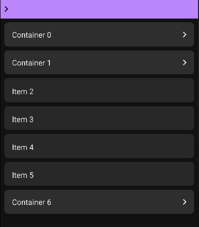

# Lazy Tree List for Jetpack Compose

<p align="center">

</p>


<p align="center">

</p>

## Getting Started

#### 1. Download

Add a dependency on the library to your Android project (Desktop not supported for now)

```kotlin
dependencies {
    implementation("io.github.mr0xf00:lazytreelist:0.1.0")
}
```

#### 2. Add LazyTreeList Composable to your composition

```kotlin
LazyTreeList(
    modifier = Modifier.weight(1f).fillMaxWidth(),
    verticalArrangement = Arrangement.spacedBy(8.dp),
    contentPadding = PaddingValues(8.dp),
    //content
)
```

#### 3. Add content :
You can either use the experimental DSL :
```kotlin
LazyTreeList(
    //...
    content = items(
        count = 10,
        subItems = { itemIndex ->
            if(itemIndex < 5) items(1) { subItemIndex -> Text("SubItem $subItemIndex") }
        }
    ) { itemIndex ->
        Text("ContainerItem $i")
    }
)
```
Or provide your own implementation of `ItemTree`
```kotlin
LazyTreeList(
    //...
    items = myData.asItemTree()
)
```
See [AppUi.kt](sample/src/main/java/com/mr0xf00/lazytreelist/ui/AppUi.kt) for an example implementation
